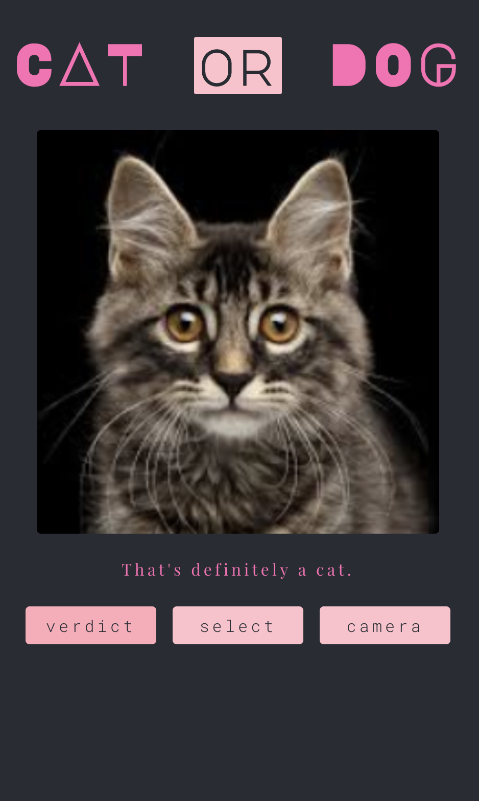

# cat-or-dog

🐈 a simple classifier app 🐕

## Classifier
Makes use of a [Resnet 50](https://pytorch.org/docs/stable/torchvision/models.html#torchvision.models.resnet50) network pretrained on [ImageNet](http://www.image-net.org/) and then tuned on this [Cat and Dog](https://www.kaggle.com/tongpython/cat-and-dog) dataset.
The model was trained for a [challenge](https://github.com/18alantom/sc_challenges/blob/master/week_2/Week%202%20-%20Challenge%202.ipynb) based on transfer learning. 
Framework used is [Pytorch](https://pytorch.org/docs/stable/index.html)

## Frontend
The frontend was created using [React](https://reactjs.org/) using [create-react-app](https://create-react-app.dev/), had to use `eject` to change the build path.

## Backend
The Backend was created using [Flask](https://flask.palletsprojects.com/en/1.1.x/).

___

To **run the app**, clone the repo; make sure [npm](https://www.npmjs.com) and other Javascript requirements along with [Python requirements](https://github.com/18alantom/cat-or-dog/blob/master/flask_server/setup.py) are installed.

`$ npm install` from the `cat-or-dog` sub directory, `$ npm run build` then from the `flask_server` sub directory set `$ export FLASK_APP=flask_server` and `$ flask run`.
___

The app may be hosted somewhere in the near future because the above procedure is almost cumbersome.